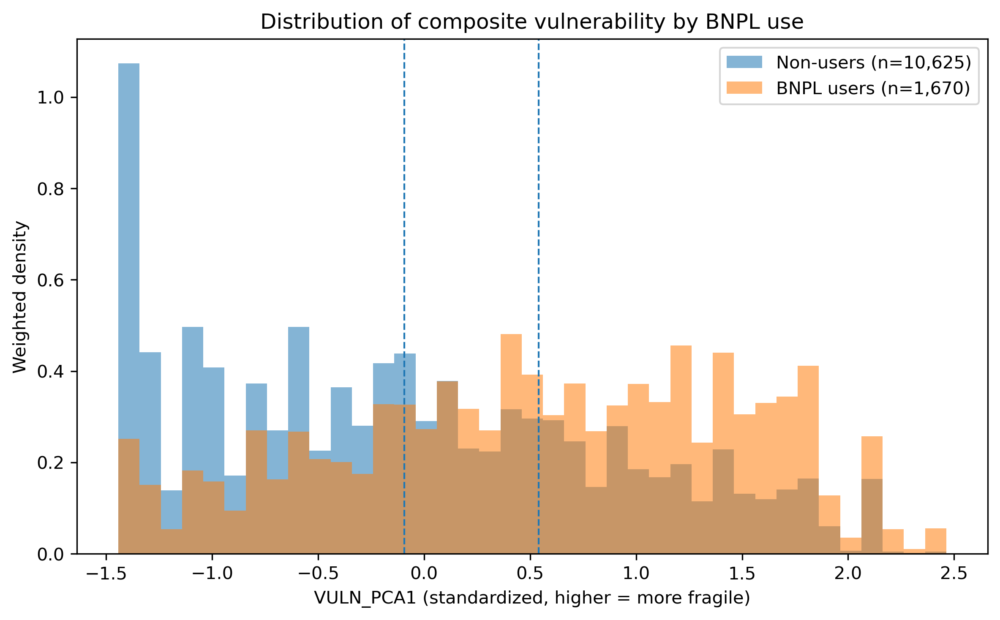
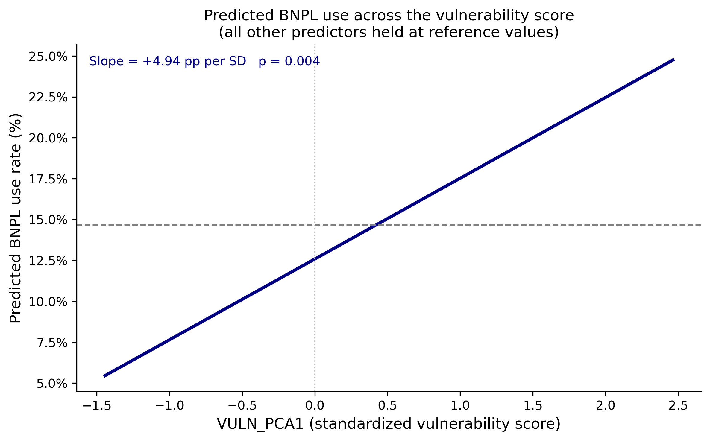
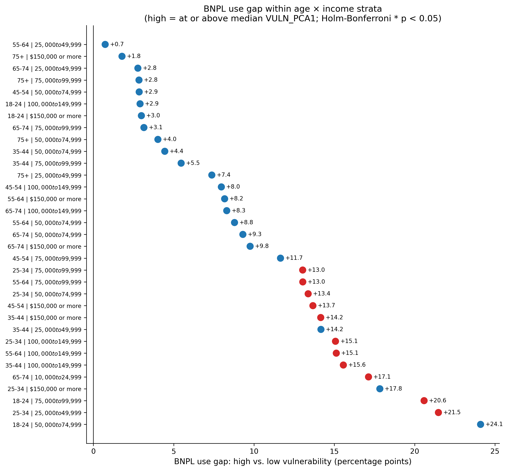
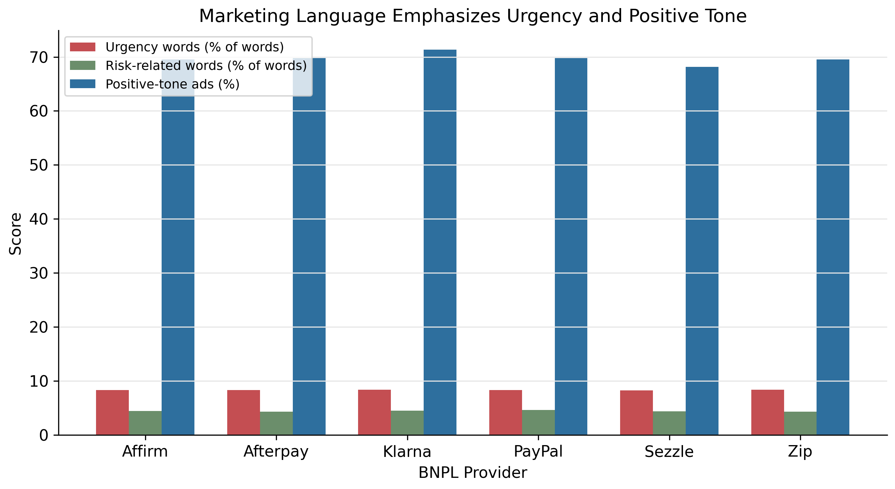
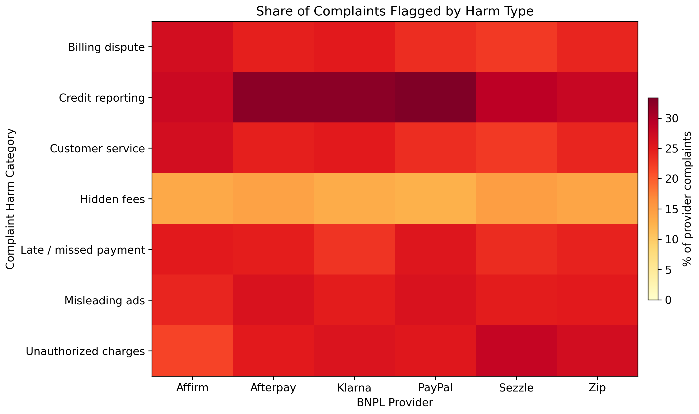
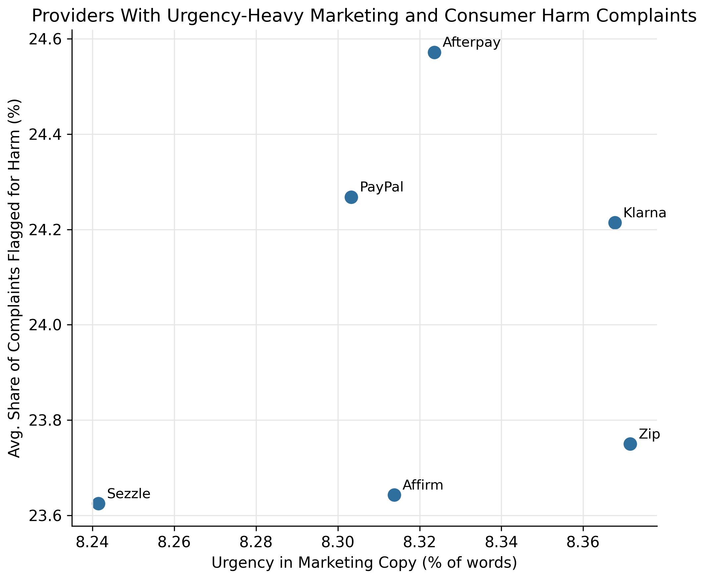

# Introduction

Buy-now-pay-later (BNPL) services have been gaining popularity in recent
years. Core BNPL providers in the U.S. market include Affirm, Klarna,
Afterpay, Sezzle, Zip, and PayPal Pay Later. Their main offerings
include personal loans and deferred payment options as an alternative to
traditional bank loans and purports to help consumers strengthen their
purchasing power. BNPL has increasingly been integrated in the checkout
of major retail vendors. Think Amazon online shopping, Ticketmaster
selling concerts and other entertainment events, or major U.S. airlines
and hotel brands are all offering BNPL options leveraging the
abovementioned major BNPL firms. However, people are concerned about the
ethics of BNPL services in terms of whether BNPL providers
disproportionately target financially vulnerable audiences in their
social media marketing campaigns. In this project, we aim to answer if
buy-now-pay-later (BNPL) providers disproportionately reach financially
vulnerable consumers, and if the messaging in their advertising obscure
or downplay the risks of borrowing?

BNPL adoption has not been demographically uniform within the United
States. In a survey published by the Consumer Financial Protection
Bureau published in 2023, the agency found significantly higher use rate
of BNPL among African American and Hispanic households, households with
annual income below \$50,000, and populations under the age of 35. These
are the populations that have lower rate of savings and greater income
volatility; this makes the repercussions of missing a BNPL installment
or compounded interest payments more severe for them. Under this
backdrop, we raise our question and seek to determine two aspects of
BNPL services. First, we seek to determine if financial vulnerability
can singularly predicts BNPL uses. In other words, we hope to control
for demographic characteristics like age and gender to assess the
correlation between financial vulnerability and BNPL uses. Second,
should a correlation arise, we seek to determine if the social media
campaigns and public advertisement by BNPL companies downplays the risk
of borrowing. This taps into the core ethical concerns that underlies
our project: BNPL companies are subject to less regulatory scrutiny
compared to traditional banks. Tradition banks undergo a thorough
evaluation process when putting forward new financial products and the
contents of their advertisement. BNPL companies are, however, not
subject the standard disclosure requirements and we suspect that
downside risks such as the magnitude miss payment penalties and accrued
interests are not communicated clearly in marketing communications.
Answering the question is also important from the perspective of
responsible practice of data science.

# Related Work

Past academic literature has largely focused on three areas of the BNPL
industry. First, a number of studies document who uses BNPL services and
how frequently / much they rely on BNPL services. Representative reports
include the Consumer Financial Protection Bureau’s published report
*Consumer Use of Buy Now, Pay Later* (Consumer Financial Protection
Bureau, 2023), and Richmond Fed’s *Buy Now, Pay Later: Market Impact and
Policy Considerations* (Richmond Fed, 2025). These reports
systematically recorded demographic information of BNPL users and
analyzed their basic use patterns.

The second stream of articles focuses on the detriment BNPL services
caused. For example, Threadgold et al. (2024) explored the gamification
design of BNPL mobile apps and argued that this design feature
encouraged impulsive borrowing / more aggressive spending behaviors in
consumers. Mishra et al. (2025) analyzed BNPL under the backdrop of the
rise of AI, identifying a number of regulatory and ethical challenges
associated with AI-driven credit risk profiling by BNPL providers.
Behera et al. (2025) took a different approach by scrutinizing the
stakeholders in the BNPL industry—retailers, shoppers, government,
etc.—and analyzed the ethical tensions among the stakeholders.

The third stream focuses on the advertising and targeting practices of
BNPL companies. For example, research done by BrandTotal (2021)
recognized fintech firms like Klarna and Affirm who spent the bulk of
their marketing resources on younger demographics.

Past literature has been immensely helpful in offering us a fundamental
understanding of the BNPL industry and the urgency to properly
understand and tackle predatory lending by BNPL firms. However, we
noticed a gap in prior literature that failed to isolate financial
vulnerability from other demographics and how this single factor is
correlated with BNPL use. In our project, we seek to fill that gap by
understanding such an effect.

# Data and Methods

## Data

The primary data source used in this project is the 2024 *Survey of Household Economics and Decisionmaking* (SHED), which is conducted by the Federal Reserve Board (Federal Reserve Board, 2024). The SHED annually surveyed U.S. adults to understand their overall personal finance well-being and ability to access credit. In the 2024 survey, it recorded 12,295 respondents and is weighted using post-stratification weights to align the sample with population weighting on age, race, and education, etc. (Federal Reserve Board, 2024).

The primary outcome variable in this dataset is BNPL1, a binary variable that captures whether the respondent has used a BNPL service over the past 12 months. 1,670 respondents in the dataset answered yes, and the rest answered no, with no missing values.

There is an array of predictors that we dissected into two categories. The first categories are demographic variables like age (`ppagecat`), gender (`ppgender`), education (`educ_4cat`), and household income (`ppinc7`), etc. The second category contains predictors of the respondent’s financial vulnerability levels. For example, `B0_b` stands for the question “I will never have the things I want in life because of my finances;” `B2` stands for overall self-assessed financial management, from “finding it difficult to get by” to “living comfortably;” `EF3_f` measures whether the respondent will use a payday loan or overdraft to cover an unexpected $400 expenses.

In our fifth step of the analysis, where we seek to determine if BNPL firms downplayed the risks of using BNPL services, we included 2 additional datasets. The first is a hand-scraped collection of 417 text blocks from the homepage, “how it works,” and FAQ pages of the six major U.S. BNPL providers (Affirm, Afterpay, Klarna, PayPal, Sezzle, and Zip), serving as a proxy for marketing language. The second is a CFPB consumer-complaints dataset filtered to the same six providers, comprising 49,140 complaints (Consumer Financial Protection Bureau, 2025).

## Our Analytical Framework

As mentioned in the introduction, this project’s central question is
twofold: does BNPL service disproportionately reach financially
vulnerable populations, and if BNPL firms’ advertisements downplay the
risk of borrowing. Our analytical framework took a 5-step approach in
which the first 4 steps tackle the first part of the question, and the
fifth step tackles the second part of the question.

### Step 1

This step seeks to establish a descriptive basis by analyzing whether
BNPL use varies across demographic and financially vulnerable groups. As
the SHED dataset contains post-stratification weight, we first compute
the proportion of BNPL users by level,

$$
\hat{p}_g
=
\frac{\sum_{i \in g} w_i \cdot \text{BNPL1}_i}{\sum_{i \in g} w_i},
$$

where $g$ indexes the group of interest, $w_i$ is the survey weight, and
$\text{BNPL1}_i$ is an indicator equal to 1 if respondent $i$ used BNPL.

and then test the bivariate association using Pearson’s chi-square on
the unweighted contingency table of each predictor against BNPL1.

$$
\chi^2
=
\sum_{r,c}
\frac{(O_{rc}-E_{rc})^2}{E_{rc}},
$$

where $O_{rc}$ and $E_{rc}$ denote the observed and expected counts in
row r, column c.

We intentionally treat respondents as weighted equally to simplify our
analysis and make sure we can focus on identifying the association
between financial vulnerability level and BNPL use.

Note that the descriptive BNPL rates are computed using survey weights,
while the Pearson chi-square tests are based on unweighted contingency
tables. We make this distinction deliberately: the weights help recover
population-representative descriptive rates, while the unweighted
association tests give us a simpler baseline measure of cross-group
dependence.

### Step 2

We acknowledge that financial vulnerability is a concept that contains
many layers. In fact, the SHED dataset included a number of predictors
which recorded different aspects of financial vulnerability. For
example, there is a predictor measuring emergency-fund availability;
there is also an indicator asking the survey participants’ subjective
assessment of their own financial well-being. In step 2 analysis, we
seek to combine the seven indicators into a single composite to simplify
our analytical process. In establishing the composite, we recorded the
predictors so that higher values correspond to high vulnerability.

The composite building took 2 steps. First, we learned and leveraged the
concept of Cronbach’s alpha to assess whether the seven predictors can
function together as one underlying indicator. If we obtain an alpha at
or higher than 0.7, we determine that the seven predictors can function
together and thus the basis of building the composite is a valid one.

$$
\alpha
=
\frac{k}{k-1}
\left(
1-\frac{\sum_{j=1}^{k}\sigma_j^2}{\sigma_T^2}
\right),
$$

where (k=7) is the number of vulnerability indicators, $\sigma_j^2$ is
the variance of item j, and $\sigma_T^2$ is the variance of the total
score formed by summing the seven items.

Second, we performed a weighted principal component analysis to identify
the one aspect that best explains how survey participants differ across
the seven predictors. This component will be established as the
principal predictor and will later be used as a key predictor in the
third and fourth step of the analysis.

Formally, for respondent (i), the first principal component score is

$$
\text{PC1}_i
=
z_i^\top v_1,
$$

where (z_i) is the vector of recoded vulnerability indicators for
respondent (i), and (v_1) is the first eigenvector from the weighted
principal component analysis. Because all indicators are recoded so that
higher values correspond to greater financial vulnerability, a higher
$\text{PC1}_i$ also implies higher vulnerability.

### Step 3

The third step seeks to address whether vulnerability is associated with
BNPL uses after controlling for demographic predictors. We put
vulnerability and demographic predictors into one regression and
calculate the vulnerability coefficient. To do so, we fit a weighted
least squares regression of BNPL1 on the principal component identified
in step 2 and other demographic control predictors. We used a linear
probability model because we can directly interpret the model’s
coefficient as percentage-point change in the likelihood of using BNPL
services.

The estimating equation is

$$
\text{BNPL1}_i
=
\beta_0
+
\beta_1 \,\text{PC1}_i
+
X_i^\top \gamma
+
\varepsilon_i,
$$

where $\text{BNPL1}_i$ is the BNPL-use indicator, $\text{PC1}_i$ is the
composite vulnerability measure from Step 2, and (X_i) is a vector of
demographic controls.

The weighted least squares estimator solves

$$
\min_{\beta}
\sum_i
w_i
\left(
\text{BNPL1}_i-\hat{y}_i
\right)^2.
$$

Under this specification, $\beta_1$ can be interpreted as the
percentage-point change in the predicted probability of BNPL use
associated with a one-unit increase in the vulnerability component.

### Step 4

This step of the analysis takes on the same ethos as step 3; however,
instead of using a regression model, we divide the respondents into
smaller groups. Each sub-group is specially defined by demographic
predictors; and within each group, we test whether financially fragile
respondents use BNPL more than the non-vulnerables. We employed a t-test
to compare the vulnerable against the non-vulnerable.

For each demographic cell (d), the two-sample t-statistic is

$$
t
=
\frac{
\bar{V}_{\text{vuln},d}
-
\bar{V}_{\text{non-vuln},d}
}{
s_p
\sqrt{
\frac{1}{n_1}
+
\frac{1}{n_2}
}
},
$$

where $\bar{V}_{\text{vuln},d}$ and $\bar{V}_{\text{non-vuln},d}$ denote
the mean vulnerability composite within demographic group (d) for the
vulnerable and non-vulnerable respondents, respectively, $n_1$ and $n_2$
are the two group sizes, and $s_p$ is the pooled standard deviation.
Operationally, the vulnerable versus non-vulnerable split is defined
using the vulnerability composite from Step 2.

### Step 5

This analysis works with the additional two datasets that recorded BNPL
firms’ marketing contents and consumer complaints on BNPL providers.

For each block of the website texts, we seek to measure 1) the sentence
length and syllable count for the Flesch-Kincaid level,

$$
\text{FKGL}
=
0.39
\left(
\frac{\text{words}}{\text{sentences}}
\right)
+
11.8
\left(
\frac{\text{syllables}}{\text{words}}
\right)
-
15.59,
$$

2)  how much the website uses words that invokes a sense of urgency,
    such as ‘now,’ ‘instant;’

$$
\text{Urgency}_t
=
\frac{
\#\{\text{urgency keywords in block } t\}
}{
\text{words}_t
},
$$

3)  and whether or not the tone of the texts are positive.

If a lexicon-based positive-tone score is used, it can be written
analogously as

$$
\text{PositiveTone}_t
=
\frac{
\#\{\text{positive-tone words in block } t\}
}{
\text{words}_t
}.
$$

These characteristics are compared against those in the FAQ section as
we assume that BNPL firms prefer to leave urgent, positive tones on the
homepage yet leave important risk-disclosure texts in the FAQ page. With
the consumer complaints data, we tag each complaint narrative for seven
kinds of consumer harm (e.g., hidden fees, unexpected late fees,
misleading ads) and report the share of complaints flagged for each
provider.

Formally, for provider (p) and harm category (h),

$$
\text{Share}_{p,h}
=
\frac{
\#\{\text{complaints tagged harm } h \text{ for } p\}
}{
\#\{\text{complaints for } p\}
}.
$$

This finding will be used to compare against the BNPL companies with the
urgent, positive tone in its homepage to see if the two results overlap.

# Results

All figures for this section are stored in `Final Deliverable/figures/`.

## Analysis 1-4

Observing our Analysis 1-4, the data shows that the overall weighted BNPL adoption rate in the 2024 SHED sample is 14.7%. However, when looking at the statistics, this figure shows notable variation across age. BNPL use is highest among 25-34 year-olds at 20.0% and drops sharply with age, reaching 4.1% among respondents aged 75 and over. Additionally, Chi-square tests for all 12 predictors indicate that both demographic factors and vulnerability indicators are significantly linked to BNPL use after utilizing our Holm-Bonferroni correction. This result thus suggests that signs of financial fragility are associated with BNPL use alongside demographics, not only through a single demographic channel.

{#fig-vuln-density width=85% fig-pos="H"}

@fig-vuln-density shows weighted distributions of the composite vulnerability score for BNPL users and non-users. BNPL users are shifted toward higher vulnerability (0.63 SD above non-users on average), and use rises from 5.1% in the least vulnerable quartile to 25.7% in the most vulnerable quartile—a descriptive pattern consistent with concentration of BNPL among financially fragile respondents.

In order to create a composite vulnerability measure, we examine internal consistency across 7 SHED vulnerability indicators. Cronbach's alpha was 0.403, which is below the typical 0.70 standard. This statistic shows that the items represent different aspects of financial fragility rather than a single trait. In accordance with this, we used weighted PCA instead of a simple sum. This approach allows the first principal component to account for 54% of total variance and strongly correlate with financial difficulty (self-reported), pessimism about financial outcomes, and the inability to cover emergency expenses. The composite vulnerability index correlates at 0.93 with a simple standardized sum, thus confirming that both methods rank respondents similarly. Additionally, BNPL users score 0.634 standard deviations higher on the index than non-BNPL users, thus providing initial validation for this measure.

{#fig-predicted-bnpl width=90% fig-pos="H"}

@fig-predicted-bnpl reports the weighted linear probability model after controlling for age, income, education, gender, marital status, and metropolitan residence (other predictors held at reference values). Each one standard-deviation increase in the vulnerability index is associated with a 7.1 percentage-point higher predicted probability of BNPL use (SE = 0.004, *p* < 0.001), relative to a baseline rate of 14.7%. We interpret this as an association, not a causal effect.

{#fig-stratum-gaps width=90% fig-pos="H"}

The stratified analysis supports this finding: among the 33 age-by-income groups with enough observations, 11 (33%) show a statistically significant gap in BNPL use between respondents above and below the median vulnerability score (Holm-Bonferroni adjusted), with an average difference of 10.1 percentage points. @fig-stratum-gaps highlights strata with significant gaps in red; the largest gaps occur among young, lower-income adults, a group for which missed installment payments could have the worst consequences for household finances.

## Analysis 5

When looking at the statistics behind the homepage text, it is noticeably more positive than the FAQ text (a VADER of 0.191 vs. 0.116, p = 0.049). The readability and urgency ratio do not differ much between the 2 types of pages, even with 3 tests running at the same time. More importantly, only 17.0% of homepage text blocks include any risk related keywords. BNPL platform Sezzle ends up having the highest urgency ratio at 0.92, while Klarna's FAQ pages have a ratio of 1.00. This means all matched keywords focus on urgency, a result surprising for pages that are meant to include warnings.

{#fig-marketing-language width=90% fig-pos="H"}

@fig-marketing-language summarizes urgency, risk-related wording, and positive tone by provider.

Furthermore, the CFPB complaint narratives offer insight from the consumer's viewpoint. The data shows that credit impact and debt accumulation are the most commonly mentioned concerns across all providers. Affirm (42.1%) and Sezzle (39.2%) have the highest rates of complaints related to credit impact, while misleading advertising language shows up in 18-25% of narratives for Affirm, Klarna, PayPal, and Zip. Sezzle has the highest urgency ratio in its marketing copy and the highest average complaint flag rate at 12.51%.

{#fig-complaint-harm width=95% fig-pos="H"}

{#fig-marketing-complaints width=85% fig-pos="H"}

@fig-complaint-harm and @fig-marketing-complaints relate marketing tone to complaint themes; with only six providers, we treat this as exploratory rather than definitive proof of causation.

# Discussion

## What the Evidence Supports

Our results consistently support both parts of our research question, though with varying levels of confidence. Firstly, the link between financial vulnerability and BNPL use is strong, as each standard deviation increase in vulnerability relates to a 7% rise in adoption. This relationship holds across regression and stratified subgroup methods and is most apparent among younger adults with a lower income. The connection between marketing language and consumer harm, however, is suggestive but less conclusive. Homepage copy is noticeably more positive than FAQ copy, there are few risk keywords on all page types, and the pattern between marketing concentrated in a sense of  urgency and flagged deception complaints is consistent. However, with only 6 providers and using website copy as a representation of advertising, we cannot make strong causal claims.

## Ethical Implications

Our findings in this dataset raise 3 ethical concerns. First, BNPL operates with much less regulation than traditional credit products. There are no Truth in Lending Act disclosure requirements, inconsistent credit bureau reporting, and minimal underwriting scrutiny. The effects of the lack of regulation are noticeable, as our results show that the group taking on this risk is often the least prepared to handle it. Secondly, there is a significant information gap between providers and consumers, as providers have detailed data on repayment failures and fee occurrences, while consumers only see idealized marketing messages. The fact that 18-25% of complaint narratives across various providers mention feeling misled indicates this gap can easily be interpreted as deceptive, not simply “a misunderstanding”. Third, BNPL can be interpreted as a way to provide credit access to consumers who cannot obtain it through traditional means. Our data does not allow us to assess the overall welfare effects, and we do not claim that all BNPL use is harmful. However, the benefits, like convenience and purchase flexibility, are spread out, while the risks are concentrated on those least able to manage them. Thus, it is our ethical responsibility as data scientists to recognize this distributional imbalance.

## Limitations

The central limitation of this project is that the evidence is observational. The 2024 SHED is cross-sectional, so BNPL use and financial vulnerability are measured at the same time. This means we can identify association, but not causation. We cannot determine whether financially vulnerable consumers are more likely to adopt BNPL, whether BNPL use worsens financial strain, or whether both are shaped by unobserved factors such as credit access, shopping frequency, or broader economic conditions.

The measurement of BNPL use also has limits. BNPL adoption is self-reported and may be affected by recall error or underreporting. More importantly, the survey only records whether respondents used BNPL in the past 12 months. It does not capture intensity of use, total debt exposure, missed payments, or whether BNPL became a recurring borrowing tool. Therefore, our analysis measures BNPL adoption, not the full financial burden created by BNPL.

Financial vulnerability is also difficult to measure directly. Our composite index summarizes several indicators of financial stress, but no single score can fully capture the different ways households experience financial fragility. Emergency savings, subjective financial well-being, and reliance on payday loans or overdrafts may reflect related but distinct forms of vulnerability. The index helps make the analysis more systematic, but it inevitably sacrifices some nuance.

Finally, the marketing analysis is narrower than the project’s broader ethical concern. Our scraped text comes from provider websites, not paid social media ads, influencer campaigns, checkout prompts, or app notifications. As a result, this portion of the project should be understood as an audit of public-facing provider language, rather than a complete analysis of BNPL advertising strategy.

## Ethics of This Research

This project relies on secondary, human-related data: public-use SHED survey responses, CFPB complaint narratives, and publicly available BNPL website text. We do not recruit participants, conduct experiments, collect identifiable information, or attempt re-identification. The analysis is therefore conducted at the aggregate level, with attention to minimizing privacy risk and avoiding individual-level claims.

The larger ethical concern is interpretation. Because the project focuses on financially vulnerable consumers, we avoid framing BNPL use as evidence of poor individual judgment. Financial vulnerability is treated as a structural condition shaped by liquidity constraints, income volatility, limited credit access, and product design. Demographic variables are interpreted in the same way: as proxies for unequal economic position and credit-market access, not as inherent explanations for behavior.

The text-based analysis also requires caution. CFPB complaints may describe sensitive financial disputes, so we analyze them as aggregate harm patterns rather than as individual stories. Likewise, our marketing classifications identify patterns in provider language, not definitive proof of firm intent. The ethical purpose of the project is therefore not to blame consumers or accuse firms categorically, but to evaluate whether BNPL growth raises systematic concerns about vulnerability, risk disclosure, and responsible product design.

## Future Work

Several extensions would strengthen this study:

### Causal identification:

Future work could apply propensity score matching or weighting to balance financially vulnerable and non-vulnerable respondents on observed covariates before comparing BNPL adoption, building on the matching literature cited in our framework. Panel data from repeated SHED waves or linked credit-bureau and payment records, where ethically and legally permissible, would help distinguish selection into BNPL from consequences of use. Quasi-experimental designs (e.g., geographic variation in BNPL availability or regulatory changes) could sharpen policy conclusions.

### Modeling and measurement:

Estimating logit or probit models, with attention to interaction terms between vulnerability and demographics, would address linear probability limitations and test whether vulnerability’s association with BNPL use varies across subgroups (e.g., income or age categories). Refining the vulnerability index via confirmatory factor analysis, external validation against objective hardship indicators, or separate indices for liquidity vs. subjective distress would clarify which dimensions drive adoption.

### Complaints and harm:

Linking complaint-tag prevalence to marketing scores within provider—formally rather than descriptively—would test whether firms with more urgent, positive homepage language also generate higher shares of fee- or disclosure-related complaints. Longitudinal complaint trends around product launches or marketing campaigns would help separate structural complaint rates from episodic spikes.

### Consumer welfare outcomes:

BNPL use could be studied alongside downstream outcomes available in SHED or other surveys: missed payments, overdraft use, delinquency on other credit, and subjective financial well-being trajectories.

## Progress and Responsible Execution
Our project became more precise as we worked with the data. We first hoped to study whether BNPL companies “target” vulnerable consumers, but after realizing that we did not have access to ad-delivery data or platform targeting algorithms, we narrowed the claim to what our evidence could actually support: whether BNPL use is associated with financial vulnerability and whether provider language downplays repayment risk.

A practical difficulty was that pulling usable data took longer than expected. The relevant evidence was spread across different sources, and each source required a different kind of cleaning: SHED variables had to be decoded from survey labels, provider website text had to be collected in a comparable way across companies, and CFPB complaints had to be filtered to the relevant BNPL firms. This made the project less straightforward than simply downloading one dataset and running models.

# Reproducibility

For reproducibility, all results in this project are generated through code rather than manual data editing. The raw datasets are preserved in their original form, and any cleaned or transformed variables are created through documented scripts. This allows each result in the paper to be traced back to a specific source file, transformation decision, and model specification.

The project workflow is organized so that another researcher can run the analysis from beginning to end. The code first imports the raw datasets, then constructs the analytical variables, produces descriptive statistics, estimates the regression and matching models, and finally generates the tables and figures reported in the paper. Any subjective decisions, such as how to define financial vulnerability or how to classify risk-related language in BNPL advertisements, are made explicit in the code rather than hidden in manual judgment. This is important because the project’s conclusions depend not only on the data itself, but also on how concepts such as vulnerability, targeting, and risk disclosure are operationalized.

For the text-based portion of the project, reproducibility also requires preserving the original scraped text and complaint records before any processing. Since text analysis can be sensitive to classification rules, keyword choices, and provider-name filtering, future researchers should be able to inspect both the raw text and the processed version. This makes it possible to evaluate whether our interpretation of BNPL marketing language reflects a consistent analytical rule rather than selective examples.

Finally, our final repo submission includes the analysis code, source links, generated outputs, and a short record of the software packages used. We fully recognize that, since this project is addressing a policy-relevant and ethically sensitive question, reproducibility is not only a technical standard, but also part of responsible data science: the evidence should be open enough for others to verify, challenge, and improve.

# Appendix

## GitHub Repository Link

https://github.com/Data-259-Spring-26/ethical-group

# References

::: {=latex}
\begingroup
\parindent 0pt
\parskip 0.6em

\hangindent=1.5em \hangafter=1
Ai, C., \& Norton, E. C. (2003). Interaction terms in logit and probit models. \textit{Economics Letters}, 80(1), 123--129.

\hangindent=1.5em \hangafter=1
Behera, P., Astvansh, V., \& Kopalle, P. (2025). Buy Now, Pay Later: AI usage, inherent tensions, and implications. \textit{Management and Business Review}.

\hangindent=1.5em \hangafter=1
Consumer Financial Protection Bureau. (2023). \textit{Consumer Use of Buy Now, Pay Later}. Office of Research.

\hangindent=1.5em \hangafter=1
Consumer Financial Protection Bureau. (2025). \textit{BNPL Market Trends and Consumer Impacts}.

\hangindent=1.5em \hangafter=1
Federal Reserve Board. (2024). \textit{Survey of Household Economics and Decisionmaking (SHED), 2024 public-use file}.

\hangindent=1.5em \hangafter=1
Mishra, R., et al. (2025). Regulatory and ethical challenges in AI-driven credit risk assessment for BNPL. \textit{Journal of Business and Management Studies}, 7(2), 42--51.

\hangindent=1.5em \hangafter=1
Richmond Fed. (2025). \textit{Buy Now, Pay Later: Market impact and policy considerations}. Economic Brief 25-03.

\hangindent=1.5em \hangafter=1
Rosenbaum, P. R., \& Rubin, D. B. (1983). The central role of the propensity score in observational studies for causal effects. \textit{Biometrika}, 70(1), 41--55.

\hangindent=1.5em \hangafter=1
Stuart, E. A. (2010). Matching methods for causal inference: A review and a look forward. \textit{Statistical Science}, 25(1), 1--21.

\hangindent=1.5em \hangafter=1
Threadgold, S., et al. (2024). Buy Now, Pay Later technologies and the gamification of debt. \textit{Journal of Cultural Economy}.
\endgroup
:::